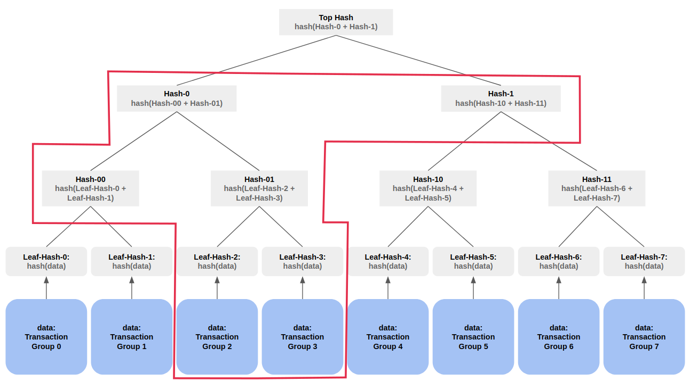

# Merkel Tree

In [Part 2: Blockchain Datastructure](./bc_proto_blockchain_ds.md) we stored the transactions as a flat string. However, typically a block may contain a large number of transactions and storing them as a flat string can become very inefficient as the blocks, often multiples of them, need to be shared between peers/nodes in the blockchain. Because of this only transactions are stored using a [Merkel tree](https://en.wikipedia.org/wiki/Merkle_tree) data structure which allows you to store a large number of transactions using a single hash - so a massive improvement in storage efficiency - and then download transactions as needed and verify them against the hash stored in the block. These structures are well established and used in many applications, but they are not considered one of the fundamental data structures, so we will spend a bit of time explaining it here.

The merkel tree structure for a set of 8 transactions is given in the figure below and illustrates the basic ideas.

The tree itself consists of the blue boxes and stores the 8 different transactions - the green boxes - via their hashes. The transactions do not form part of the tree. The tree is always a [binary tree](https://en.wikipedia.org/wiki/Binary_tree). Each leaf contains the hash of a single block of data (not to be confused with a blockchain block!) which may be a group of transactions or a single transaction. The hash of any internal node is the hash of the concatenation of hashes of its two children nodes.

The key idea behind using Merkel trees in blockchains (and other applications) is that only the top-hash is stored in a block rather than transactions or even the whole tree itself. When it is required to access a particular transaction, only the data block containing the transaction and the hashes required to prove that it was not corrupted is downloaded from some known, but not necessarily trusted, node and then validated against the top hash. This way we do not need to download the whole tree let alone all the transactions.

For instance, in the example above, if we want to get a transaction from transaction group 3, then we donwload `Transaction-Group-3`, `Leaf-Hash-2, Leaf-Hash-3`, `Hash-00, Hash-01`, `Hash-0` and `Hash-1`. This is illustrated in the figure below and this information is called the _proof_ of the Transaction-Group-3. By the [uniqueness property](./blockchain_ds.md###uniqueness-of-hash-functions) of hash functions, we can calculate the hash of Transaction-Group-3 and the recalculate all the intermediate hashes to ensure that it matches the Top-Hash. That is we:

1. Hash `Transaction-Group-3` to get `new-Leaf-Hash-3` and make sure it matches the downloaded `Leaf-Hash-3`.
2. Ensure that downloaded `Hash-01` is equal to `hash(Leaf-Hash-2 + Leaf-Hash-3)`, where the `Leaf-Hash-2` and `Leaf-Hash-3` are downloaded (here `+` is string concatenation).
3. Ensure downloaded `Hash-0` is equal to `hash(Hash-00 + Hash-01)`where the `Hash-00` and `Hash-01` are also downloaded.
4. Ensure that the `Top-Hash` stored in the block is equal to `hash(Hash-0 + Hash-1)` where, again, `Hash-0` and `Hash-1` are also downloaded.

So, stepping back for a moment into the savings in terms of amount of data downloaded, instead of downloading `k` blocks of data, containing all the transactions, we would download `2lg(k)` of hashes and one block of data - a significant saving.

A simple implementation of Merkel Trees is given in [here](../blockchain_proto/merkel_tree.py). The implementaation used in blockchain platforms are likely to be very different due performance and security considerations.
